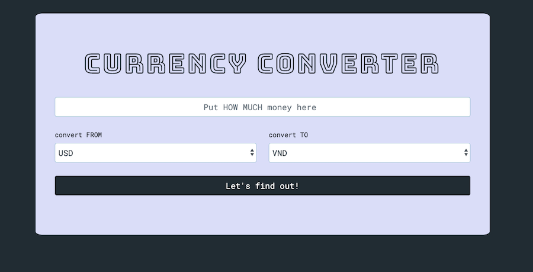
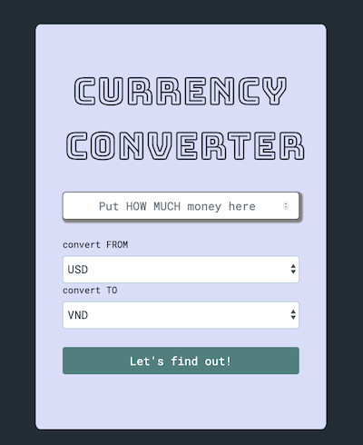

# Currency Converter
> Week 2: Intro to JavaScript - LAB: CURRENCY CONVERTER (BASIC)

For our introduction to javascript, we created a currency converter. 

## Javascript

Created a function to give us an exchange rate, once supplied two inputs (fromCurrency, toCurrency).
Used conditionals, listing options for those variables and what each combination should give as output.
We were able to cut the number of conditionals in half by using a recursive else statement to have it run the list again but with the inputs reversed.
And some javascript to get the result, identify where to get the amount from, and to print the result.

### Styling

I thought a photo background looked too complicated for the simple application, so I found a color scheme and applied it to a bootstrap form component. I adjusted some sizes, font styles, and borders to stand out more and add more interaction. 

[Color Scheme](https://coolors.co/5a7d7c-dadff7-232c33-a0c1d1-b5b2c2)

